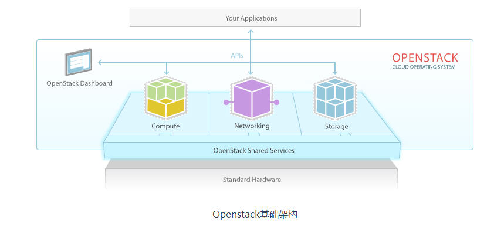
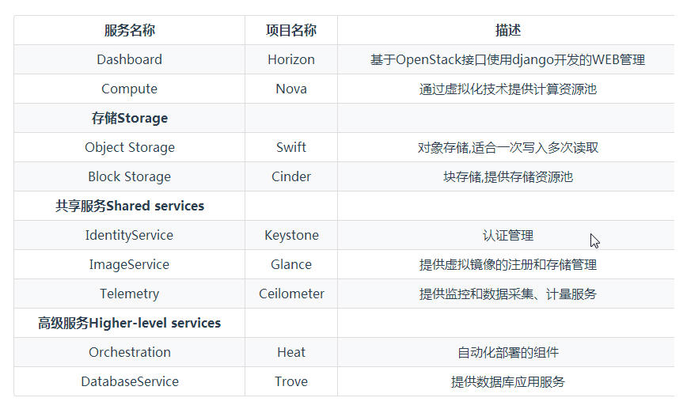
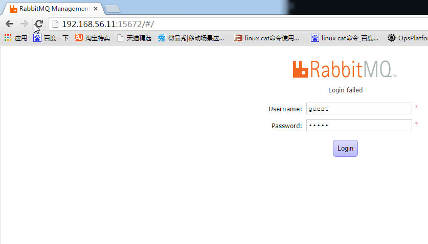
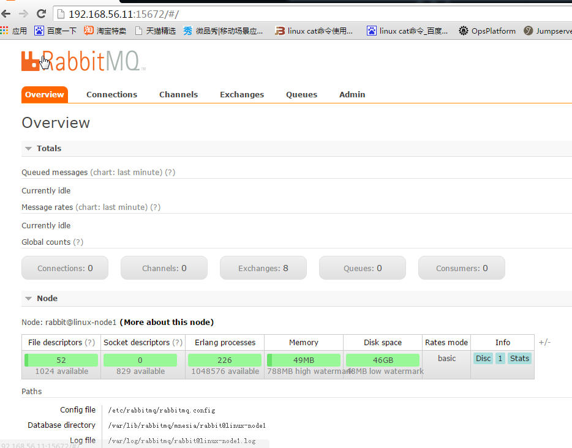
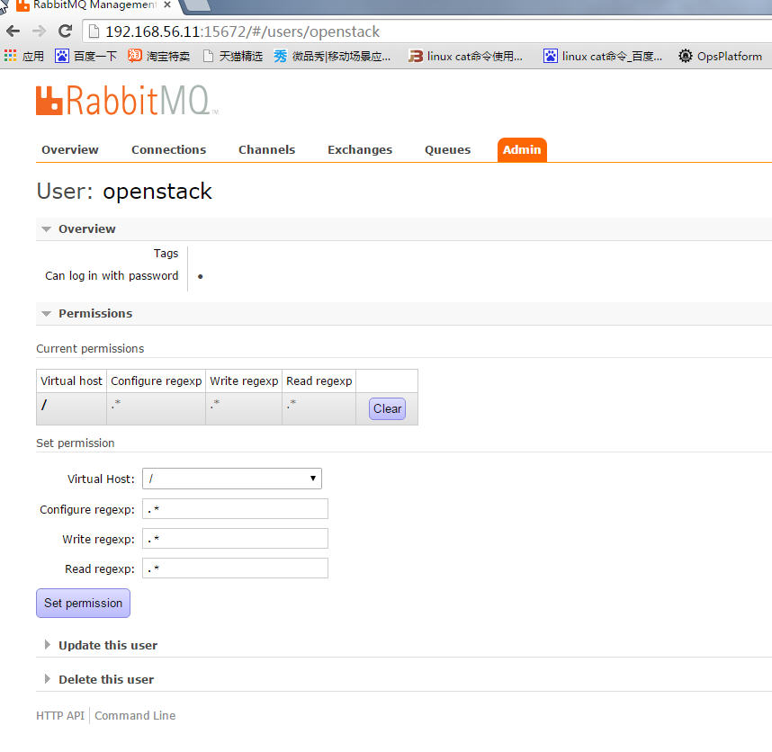
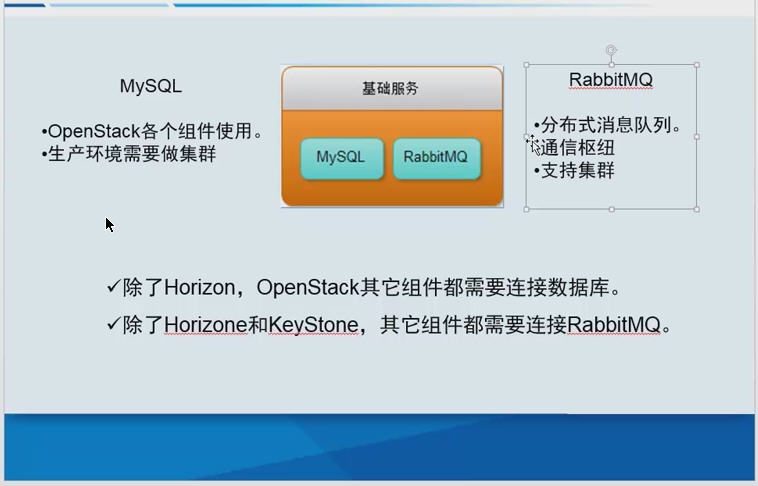

# 一 Openstack介绍 
## 1.1 基本简介
####
###OpenStack是一个开源的云计算管理平台项目，项目目标是提供实施简单、可大规模扩展、丰富、标准统一的云计算管理平台，OpenStack支持几乎所有类型的云环境，OpenStack通过各种互补的服务提供了基础设施即服务（IaaS）的解决方案，每个服务提供API以进行集成， OpenStack是一个旨在为公共及私有云的建设与管理提供软件的开源项目， OpenStack项目的首要任务是简化云的部署过程并为其带来良好的可扩展性,可通过OpenStack前端来设置及管理自己的公共云或私有云。

## 1.2Openstack项目组件

# 二 Openstack 实战环境  
> 2.1 本实验使用俩台centos7.2系统     
> 2.2 关闭防火墙，selinux等     
> 2.3 安装Centos7.x系统时在启动选项添加内核参数 net.ifnames=0 biosdevname=0    

* 2.4 主机名解析
<pre>
cat /etc/hosts
127.0.0.1   localhost localhost.localdomain localhost4 localhost4.localdomain4
::1         localhost localhost.localdomain localhost6 localhost6.localdomain6
192.168.56.11 linux-node1 linux-node1.example.com
192.168.56.12 linux-node2 linux-node2.example.com
</pre> 
* 2.5 服务器时间同步
<pre>
# yum install ntpdate -y     
# timedatectl set-timezone Asia/Shanghai    
# ntpdate time1.aliyun.com
25 Oct 15:42:06 ntpdate[13519]: step time server 115.28.122.198 offset -28520.971696 sec
# date
Tue Oct 25 23:42:07 CST 2016

</pre>

# 三 Openstack 基础服务安装 

### 3.1 安装EPEL仓库  
<pre>
# wget -O /etc/yum.repos.d/CentOS-Base.repo http://mirrors.aliyun.com/repo/Centos-7.repo
</pre>

### 3.2 安装Openstack仓库
<pre>
# yum install -y centos-release-openstack-mitaka
</pre>

### 3.3 安装Openstack客户端
<pre>
# yum install -y python-openstackclient
</pre> 

### 3.4 安装Openstack Selinux管理包 
<pre>
# yum install -y openstack-selinux
</pre>

### 3.5 mysql数据库安装(生产环境建议做集群)
<pre>
[root@linux-node1 ~]# yum install -y mariadb mariadb-server python2-PyMySQL
# cd /etc/my.cnf.d/
# vim openstack.cnf
[mysqld]
bind-address = 192.168.56.11         #控制节点ip
default-storage-engine = innodb      #默认使用的引擎
innodb_file_per_table                #使用独享表空间
max_connections = 4096               #最大的连接数，默认1024
collation-server = utf8_general_ci   #默认的校对规则
character-set-server = utf8          #默认的字符集
# systemctl enable mariadb.service   #设置开机启动
# systemctl start mariadb.service    #启动数据库
# 为了保证数据库服务的安全性，运行``mysql_secure_installation``脚本。特别需要说明的是，为数据库的root用户设置一个适当的密码。
# mysql_secure_installation
 

NOTE: RUNNING ALL PARTS OF THIS SCRIPT IS RECOMMENDED FOR ALL MariaDB
      SERVERS IN PRODUCTION USE!  PLEASE READ EACH STEP CAREFULLY!

In order to log into MariaDB to secure it, we'll need the current
password for the root user.  If you've just installed MariaDB, and
you haven't set the root password yet, the password will be blank,
so you should just press enter here.

Enter current password for root (enter for none): 
OK, successfully used password, moving on...

Setting the root password ensures that nobody can log into the MariaDB
root user without the proper authorisation.

Set root password? [Y/n] Y
New password: 
Re-enter new password: 
Password updated successfully!
Reloading privilege tables..
 ... Success!

By default, a MariaDB installation has an anonymous user, allowing anyone
to log into MariaDB without having to have a user account created for
them.  This is intended only for testing, and to make the installation
go a bit smoother.  You should remove them before moving into a
production environment.

Remove anonymous users? [Y/n] Y
 ... Success!

Normally, root should only be allowed to connect from 'localhost'.  This
ensures that someone cannot guess at the root password from the network.

Disallow root login remotely? [Y/n] Y
 ... Success!

By default, MariaDB comes with a database named 'test' that anyone can
access.  This is also intended only for testing, and should be removed
before moving into a production environment.

Remove test database and access to it? [Y/n] Y
 - Dropping test database...
 ... Success!
 - Removing privileges on test database...
 ... Success!

Reloading the privilege tables will ensure that all changes made so far
will take effect immediately.

Reload privilege tables now? [Y/n] Y
 ... Success!

Cleaning up...

All done!  If you've completed all of the above steps, your MariaDB
installation should now be secure.

Thanks for using MariaDB!
------------------------------------------------------------------------------
# 创建数据库并且授权，给后面用到的每个服务
# MariaDB [(none)]> create database keystone;
Query OK, 1 row affected (0.00 sec)

# MariaDB [(none)]> grant all on keystone.* to 'keystone'@'localhost' identified by 'keystone';
Query OK, 0 rows affected (0.00 sec)

# MariaDB [(none)]> grant all on keystone.* to 'keystone'@'%' identified by 'keystone';         
Query OK, 0 rows affected (0.00 sec)
---------------------------------------------
# MariaDB [(none)]> create database glance;
Query OK, 1 row affected (0.00 sec)

# MariaDB [(none)]> grant all on glance.* to 'glance'@'localhost' identified by 'glance';
Query OK, 0 rows affected (0.00 sec)

# MariaDB [(none)]> grant all on glance.* to 'glance'@'%' identified by 'glance';         
Query OK, 0 rows affected (0.00 sec)
---------------------------------------------
# MariaDB [(none)]> create database nova;
Query OK, 1 row affected (0.00 sec)

# MariaDB [(none)]> grant all on nova.* to 'nova'@'localhost' identified by 'nova';
Query OK, 0 rows affected (0.00 sec)

# MariaDB [(none)]> grant all on nova.* to 'nova'@'%' identified by 'nova';         
Query OK, 0 rows affected (0.00 sec)
----------------------------------------------
# MariaDB [(none)]> create database nova_api;
Query OK, 1 row affected (0.00 sec)

# MariaDB [(none)]> grant all on nova_api.* to 'nova'@'localhost' identified by 'nova';
Query OK, 0 rows affected (0.00 sec)

# MariaDB [(none)]> grant all on nova_api.* to 'nova'@'%' identified by 'nova';         
Query OK, 0 rows affected (0.00 sec)
-----------------------------------------------
MariaDB [(none)]> create database neutron;
Query OK, 1 row affected (0.00 sec)

MariaDB [(none)]> grant all on neutron.* to 'neutron'@'localhost' identified by 'neutron';
Query OK, 0 rows affected (0.00 sec)

MariaDB [(none)]> grant all on neutron.* to 'neutron'@'%' identified by 'neutron';         
Query OK, 0 rows affected (0.00 sec)
---------------------------------------------
# MariaDB [(none)]> select user,host from mysql.user;
+----------+-----------+
| user     | host      |
+----------+-----------+
| glance   | %         |
| keystone | %         |
| neutron  | %         |
| nova     | %         |
| root     | 127.0.0.1 |
| root     | ::1       |
| glance   | localhost |
| keystone | localhost |
| neutron  | localhost |
| nova     | localhost |
| root     | localhost |
+----------+-----------+
# MariaDB [(none)]> show databases;
+--------------------+
| Database           |
+--------------------+
| glance             |
| information_schema |
| keystone           |
| mysql              |
| neutron            |
| nova               |
| nova_api           |
| performance_schema |
+--------------------+
</pre>

### 3.6 安装RabbitMQ （生产建议使用集群，内存，硬盘可以同时使用）
<pre>
[root@linux-node1 ~]# yum install -y rabbitmq-server
# systemctl enable rabbitmq-server.service
# systemctl start rabbitmq-server.service
# rabbitmqctl add_user openstack openstack  #创建openstack用户openstack密码
Creating user "openstack" ...
# rabbitmqctl set_permissions openstack ".*" ".*" ".*"  #给``openstack``用户配置写和读权限
Setting permissions for user "openstack" in vhost "/" ...
# rabbitmq-plugins list #查看监控插件  
# rabbitmq-plugins enable rabbitmq_management  #启用web页面 
The following plugins have been enabled:
  mochiweb
  webmachine
  rabbitmq_web_dispatch
  amqp_client
  rabbitmq_management_agent
  rabbitmq_management
# lsof -i : 5672 #端口
# lsof -i : 15672 #管理端口
</pre>

### 3.6.1 允许openStack用户登陆RabbitMQ消息队列服务

### 3.6.2 小结

>##影响创建虚拟机有如下服务：      
> a. 时间同步     
> b. 数据库     
> c. rabbitmq    
   