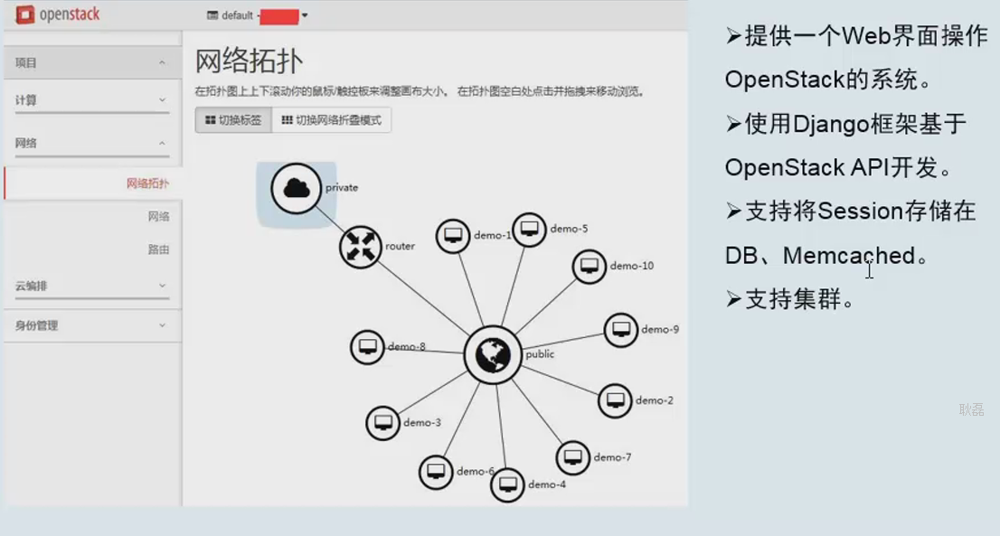
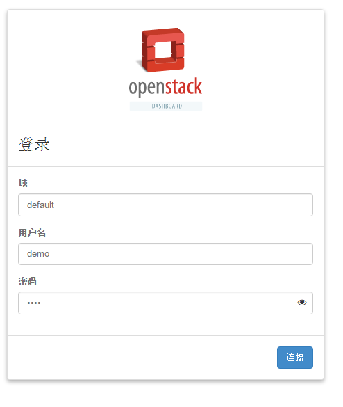
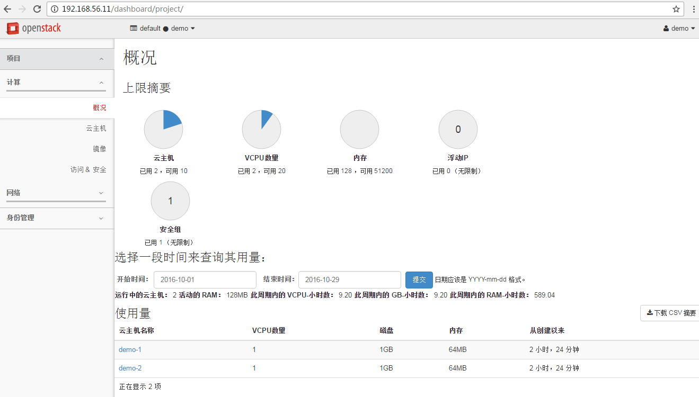
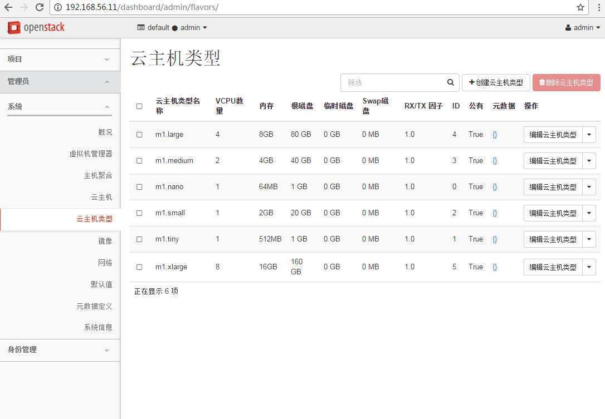
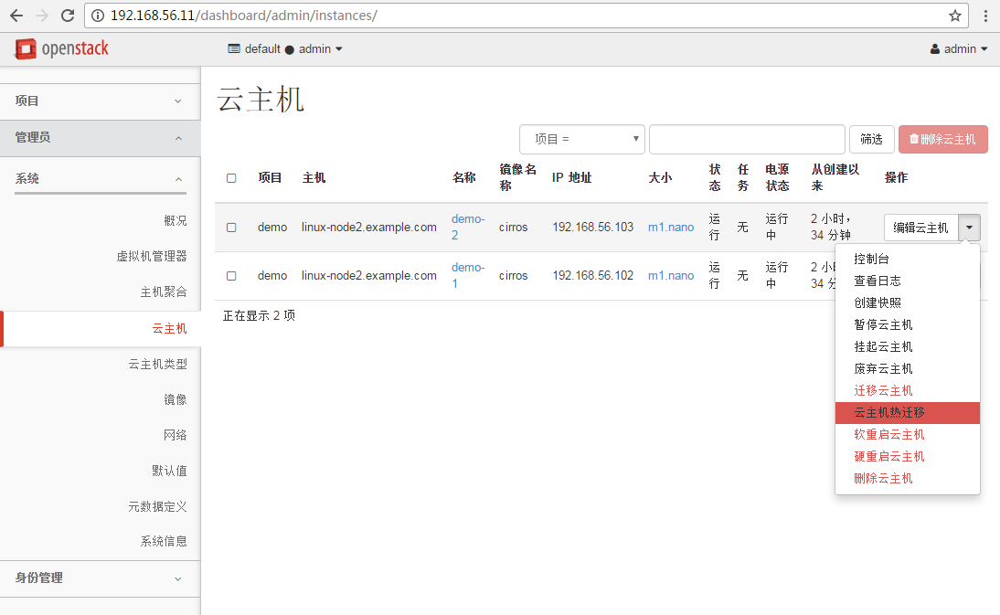
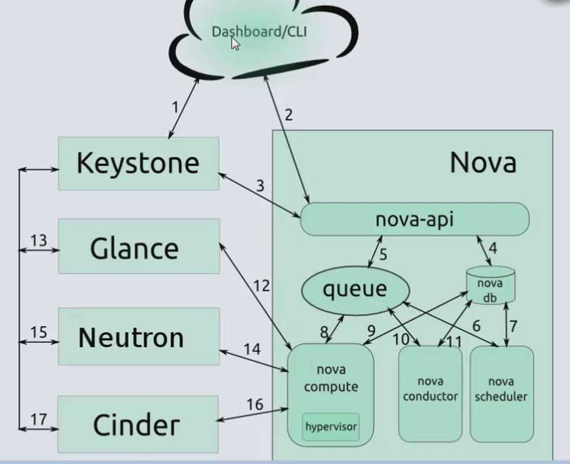

# 一 dashboard 简介

 

# 二 安装部署

### 2.1 安装dashboard
<pre>
# yum install openstack-dashboard
</pre>

### 2.2 编辑文件 /etc/openstack-dashboard/local_settings 并完成如下动作：
<pre>
# 158 OPENSTACK_HOST = "192.168.56.11"
# 159 OPENSTACK_KEYSTONE_URL = "http://%s:5000/v3" % OPENSTACK_HOST
# 160 OPENSTACK_KEYSTONE_DEFAULT_ROLE = "user" 默认角色
# 30 ALLOWED_HOSTS = ['*', ] #允许访问的主机
----------
#设置相关的版本
# 55 OPENSTACK_API_VERSIONS = {
# 56 #    "data-processing": 1.1,
# 57     "identity": 3,
# 58     "volume": 2,
# 59     "compute": 2,
# 60 }
# 64 OPENSTACK_KEYSTONE_MULTIDOMAIN_SUPPORT = True #启用对域的支持
# OPENSTACK_KEYSTONE_DEFAULT_DOMAIN = 'default' #过仪表盘创建用户时的默认域配置为 default
# 370 TIME_ZONE = "Asia/Shanghai" #修改时区
</pre>

### 2.3 禁用支持3层网络服务(目前是单一扁平网络，不禁用会报错)
<pre>
260 OPENSTACK_NEUTRON_NETWORK = {
261     'enable_router': False,
262     'enable_quotas': False,
263     'enable_ipv6': False,
264     'enable_distributed_router': False,
265     'enable_ha_router': False,
266     'enable_lb': False,
267     'enable_firewall': False,
268     'enable_vpn': False,
269     'enable_fip_topology_check': False,
# systemctl restart httpd.service memcached.service 重启服务
</pre>

### 2.4 访问 http://192.168.56.11/dashboard/

 
### 2.5 查看openstack云主机

### 2.6 使用admin登录云主机

### 2.7 查看云主机类型

### 3.1 创建虚拟机流程(重要)
